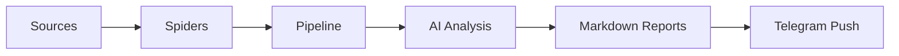

# Tech Pulse

[English documentation](README.md)

**Tech Pulse** 是一个面向开发者与独立研究者的降噪 AI 信息工作流。

它会从 GitHub、Hugging Face 和 Product Hunt 抓取热门项目与帖子，补充详情内容，结合 AI 生成简评和总览，并最终产出一组适合归档、检索和转发的 Markdown 报告。

---

## 项目愿景

在信息爆炸的环境里，真正稀缺的往往不是信息本身，而是稳定、低噪声、能持续消费的判断材料。

Tech Pulse Pipeline 想做的，不只是一次性的热点抓取脚本，而是一条从原始数据到高价值信息的处理链路：持续采集、适度深挖、结构化整理、总结归档，再把值得关注的内容稳定地交付出来。它希望逐步演进成一个轻量且长期可扩展的个人技术信息管线。

---

## 当前能力

你可以把这个项目想象成一条全自动的“信息提纯流水线”，整个工作过程一气呵成。

首先是收集阶段。这个工具会自动去 GitHub、Hugging Face 和 Product Hunt 这三个技术圈最活跃的平台上，把当下最受关注的热门代码仓库、热门 AI 模型以及热门帖子全部找出来。

找到这些热门内容后，它不会只停留在看看标题的表面功夫，而是会进行深度挖掘。它会顺藤摸瓜，把 GitHub 和 Hugging Face 里的 README 说明文档及基础数据，还有 Product Hunt 上的详细帖子内容与描述信息都完整地抓取下来，确保掌握最详尽的原始资料。

收集完这些厚厚的资料后，AI 就开始发挥作用了。它会通过接入的接口阅读这些内容，然后为每一个抓取到的项目或帖子单独写一段精炼的点评，告诉你它到底是干嘛的。不仅如此，AI 还会纵观当天的所有内容，自动为你总结出一份全局视角的总览报告。

最后，所有这些经过 AI 咀嚼、提炼的信息，都会被整整齐齐地排版成易于阅读的 Markdown 格式。最终交付到你手里的，不再是杂乱无章的网页链接和冗长的原网页，而是一份干净、纯粹，可以直接阅读、归档或转发的高信噪比信息简报，你还可以配置Telegram BOT, 从Telegram获取结果。


---

## 系统架构

从职责上看，当前项目可以理解为一条轻量的技术信息流水线：



- `Sources`
  - GitHub Trending
  - Hugging Face
  - Product Hunt
- `Spiders`
  - 负责列表抓取和详情抓取
- `Pipeline`
  - 负责深抓、AI 分析、总览生成和结果汇总
- `Delivery`
  - 负责 Markdown 报告输出和 Telegram 推送

---

## 技术栈

- `Python 3.10+`
- `requests`
- `httpx`
- `jinja2`
- `rich`
- `watchdog`
- `diskcache`
- OpenRouter-compatible API

---

## 路线图

当前版本已经能抓取各项信息源热门项目的详细信息，将信息给AI进行分析，生成去除噪音的文本内容并推送。但是这个项目不止于此

后续计划包括：

- [ ] 增加自动调度能力
- [ ] 补充 GitHub Actions或者Docker file 或其他方案
- [ ] 强化历史状态管理与去重
- [ ] 引入个性化上下文和偏好权重
- [ ] 增加趋势聚类、主题归纳和 anti-hype 过滤
- [ ] 扩展更多技术信号源

---

## 快速开始

### 1. 安装依赖

```bash
pip install -r requirements.txt
```

### 2. 配置环境变量

建议复制 `.env-example` 为 `.env` 并按需填写。以下示例与仓库内 `.env-example` 保持一致（含注释与占位符）：

```env
# Product Hunt API Token (v2 Developer Token)
PH_API_TOKEN=YOUR_PH_API_TOKEN_HERE

# GitHub Personal Access Token (提升 API 限制)
GITHUB_TOKEN=YOUR_GITHUB_TOKEN_HERE

# Hugging Face Access Token (可选，用于提升 API 速率限制)
# 获取地址: https://huggingface.co/settings/tokens
HF_TOKEN=YOUR_HF_TOKEN_HERE

OPENROUTER_API_KEY=YOUR_OPENROUTER_API_KEY_HERE
OPENROUTER_BASE_URL=https://openrouter.ai/api/v1
OPENROUTER_MODEL=google/gemini-2.0-flash-001

TG_BOT_TOKEN=YOUR_Telegram_Bot_Token_HERE

TG_CHAT_ID=YOUR_Telegram_Chat_ID_HERE

# 报告监听目录 (默认为 reports，用于 Telegram 自动推送)
REPORT_WATCH_DIR=reports

# Overview summary generation
OVERVIEW_ENABLED=true
OVERVIEW_AI_ENABLED=true
OVERVIEW_MODEL=minimax/minimax-m2.5:free
OVERVIEW_MAX_INPUT_ITEMS=6
OVERVIEW_MAX_OUTPUT_CHARS=1200
OVERVIEW_INCLUDE_AI_COMMENT=true

# 渠道 AI 点评：写入报告前最大字符数（0=不截断）
AI_COMMENT_MAX_CHARS=2000
# 流式仅使用 delta.content；若整段为空则回退拼接 reasoning 字段（默认 false）
OPENROUTER_STREAM_FALLBACK_TO_REASONING=false
# 渠道分析请求的 max_tokens 上限（与短评提示词对齐）
AI_COMMENT_MAX_TOKENS=768
# 可选：合并进 chat/completions 请求体的额外 JSON（依网关而定）
# OPENROUTER_CHAT_COMPLETIONS_EXTRA_JSON=
```

说明：

- `PH_API_TOKEN` 是抓取 Product Hunt 的必需项
- `GITHUB_TOKEN` 和 `HF_TOKEN` 不是必需，但有助于提升 API 可用性
- `OPENROUTER_*` 控制 OpenRouter 兼容网关；`OPENROUTER_API_KEY` 缺失时，AI 分析与总览可能跳过或回退
- `TG_BOT_TOKEN` 与 `TG_CHAT_ID` 同时配置时，才会启用 Telegram 推送
- `REPORT_WATCH_DIR` 为监听目录，默认 `reports`
- `OVERVIEW_*` 控制总览是否启用、是否走 AI、所用模型与输入条数、输出长度、是否包含各渠道 AI 短评
- `AI_COMMENT_MAX_CHARS`、`AI_COMMENT_MAX_TOKENS`、`OPENROUTER_STREAM_FALLBACK_TO_REASONING` 控制渠道短评长度、token 上限与流式回退；`OPENROUTER_CHAT_COMPLETIONS_EXTRA_JSON` 可选，用于向网关追加请求体字段

更多解析与默认值仍以 `utils/config.py` 为准。

### 3. 运行

```bash
python main.py
```

当前命令行参数以 `main.py` 为准：

```bash
python main.py [--deep|--no-deep] [--ai|--no-ai] [--watch|--no-watch] [--limit N]
```

示例：

```bash
# 默认运行
python main.py

# 不做深度抓取和 AI 分析
python main.py --no-deep --no-ai

# 每个来源只抓取 3 条
python main.py --limit 3

# 只生成报告，不推送 Telegram
python main.py --no-watch
```

### 4. 运行单元测试

在项目根目录执行（标准库 `unittest`，无需 pytest）：

```bash
python -m unittest discover -s test -p "test_*.py" -v
```

说明：`test/test_first_token_latency.py` 与 `test/openrouter_raw_probe.py` 依赖外网与 API Key，不会被上述 discover 自动匹配（文件名不以 `test_` 开头或不在默认 `test_*.py` 模式中时请单独运行）。

### 5. 输出结果

每次运行会在 `reports/` 下生成一个新的批次目录，例如：

```text
reports/
`-- TECH_PULSE_20260328_091045/
    |-- overview.md
    |-- github.md
    |-- hf.md
    `-- ph.md
```

- `overview.md` 是总览摘要
- `github.md` 是 GitHub Trending 详细报告
- `hf.md` 是 Hugging Face 详细报告
- `ph.md` 是 Product Hunt 详细报告

---

## 开源协议

[MIT License](LICENSE)
