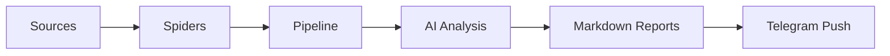
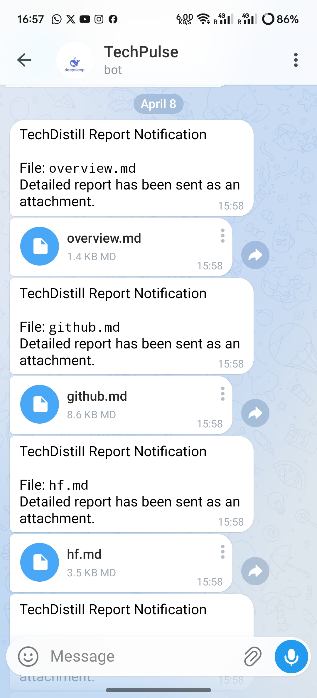

# TechDistill

[简体中文](README-CN.md)

**TechDistill** is a noise-reducing AI information workflow for developers and independent researchers.

It scrapes trending projects and posts from GitHub, Hugging Face, and Product Hunt, enriches them with detail, uses AI to generate brief commentary and a daily overview, and produces a set of Markdown reports you can archive, search, and share.

---

## Vision

In a world of information overload, what is often scarce is not raw data, but stable, low-noise material you can keep reading and reasoning from.

TechDistill Pipeline aims to be more than a one-off trending scraper: it is a path from raw inputs to higher-signal outputs—continuous collection, measured deep dives, structured organization, summarized archives, and steady delivery of what matters. It is meant to grow into a lightweight, long-lived personal technical information pipeline.

---

## Current capabilities

You can think of this project as a fully automated “information refinement” pipeline that runs end to end.

**Collection.** The tool pulls the most visible repositories on GitHub, models on Hugging Face, and posts on Product Hunt from three of the busiest corners of the tech community.

**Enrichment.** It does not stop at titles. It follows through to GitHub READMEs, Hugging Face Model Cards, and baseline metadata, as well as full post bodies and descriptions on Product Hunt, ensuring the source material is as complete as practical.

**AI analysis.** Through a pluggable API, the model reads that material, writes a short note for each item on what it actually is, and produces a bird’s-eye overview across everything captured in a run.

**Delivery.** The refined content is laid out as readable Markdown. What you get is a clean, high-signal briefing instead of a pile of tabs and long raw pages. You can also wire a Telegram bot to receive results in Telegram.

---

## Architecture

By responsibility, the project is a lightweight technical information pipeline:



- `Sources`
  - GitHub Trending
  - Hugging Face
  - Product Hunt
- `Spiders`
  - List and detail scraping
- `Pipeline`
  - Deep fetch, AI analysis, overview generation, and aggregation
- `Delivery`
  - Markdown report output and Telegram push

---

## Telegram delivery

When Telegram push is configured, each Markdown report is delivered as a file attachment in chat. Example (TechPulse bot):



---

## Tech stack

- `Python 3.10+`
- `requests`
- `httpx`
- `jinja2`
- `rich`
- `watchdog`
- `diskcache`
- OpenRouter-compatible API

---

## GitHub Actions

The repository includes [`.github/workflows/prism-pipeline.yml`](.github/workflows/prism-pipeline.yml), which runs the full pipeline on GitHub-hosted runners: crawling, AI analysis, Markdown reports, and optional Telegram push (`main.py`).

- **Schedule:** `cron: "28 6 * * *"` — once per day at **06:28 UTC** (adjust the expression in the workflow file if you want a different time).
- **Manual runs:** `workflow_dispatch` is enabled so you can start a run from the Actions tab.
- **Secrets:** Configure repository secrets to match your needs (see the comments at the top of the workflow file and [`.env-example`](.env-example)). Typical values include `PH_API_TOKEN`, `GH_TOKEN` (injected as `GITHUB_TOKEN`), `OPENROUTER_API_KEY`, and optionally `HF_TOKEN`, `TG_BOT_TOKEN`, `TG_CHAT_ID`, and `OPENROUTER_CHAT_COMPLETIONS_EXTRA_JSON`. **How to obtain each credential** is documented in [**`Access_Token/en.md`**](Access_Token/en.md) (English)。
- **Artifacts:** The default job does not commit reports to the branch; output exists for that run on the runner unless you add upload/push steps.

---

## Roadmap

The current release already fetches rich detail from each source, sends it through AI, produces de-noised text, can push notifications, and can run on a **daily GitHub Actions schedule**.

Planned work includes:

- [ ] Dockerfile or other deployment options
- [ ] Stronger history, state management, and deduplication
- [ ] Personal context and preference weighting
- [ ] Trend clustering, topic synthesis, and anti-hype filtering
- [ ] More technical signal sources

---

## Quick start

**OpenRouter — model choice (read this).** On **GitHub Actions**, **do not use free / `:free` models**. Runners are usually on **Microsoft Azure**; OpenRouter applies **strict limits on concurrent requests from that region**. For [`.github/workflows/openrouter-first-token-latency.yml`](.github/workflows/openrouter-first-token-latency.yml), which runs `test/test_first_token_latency.py`, **every run that used a free model has failed—there has never been a successful finish.** Use a **low-cost paid** model id with the same workflow. Apply the same rule to `OPENROUTER_MODEL`, `OVERVIEW_MODEL`, and any model you set in Actions env/secrets when you rely on CI or concurrency.

### 1. Install dependencies

```bash
pip install -r requirements.txt
```

### 2. Environment variables

**Credentials tutorial:** For full instructions on obtaining every token and secret used below (Product Hunt, GitHub, Hugging Face, OpenRouter, Telegram), see [**`Access_Token/en.md`**](Access_Token/en.md) (English) and [**`Access_Token/cn.md`**](Access_Token/cn.md) (简体中文).

Copy `.env-example` to `.env` and fill in your values. The block below matches the repository `.env-example` (comments and placeholders included):

```env
# Product Hunt API Token (v2 Developer Token)
PH_API_TOKEN=YOUR_PH_API_TOKEN_HERE

# GitHub Personal Access Token (higher API rate limits)
GITHUB_TOKEN=YOUR_GITHUB_TOKEN_HERE

# Hugging Face Access Token (optional; improves API rate limits)
# Create at: https://huggingface.co/settings/tokens
HF_TOKEN=YOUR_HF_TOKEN_HERE

OPENROUTER_API_KEY=YOUR_OPENROUTER_API_KEY_HERE
OPENROUTER_BASE_URL=https://openrouter.ai/api/v1
OPENROUTER_MODEL=google/gemini-2.0-flash-001

TG_BOT_TOKEN=YOUR_Telegram_Bot_Token_HERE

TG_CHAT_ID=YOUR_Telegram_Chat_ID_HERE

# Report directory to watch (default reports; used for Telegram auto-push)
REPORT_WATCH_DIR=reports

# Overview summary generation
OVERVIEW_ENABLED=true
OVERVIEW_AI_ENABLED=true
OVERVIEW_MODEL=minimax/minimax-m2.5:free
OVERVIEW_MAX_INPUT_ITEMS=6
OVERVIEW_MAX_OUTPUT_CHARS=1200
OVERVIEW_INCLUDE_AI_COMMENT=true

# Per-channel AI comments: max characters before writing to report (0 = no truncation)
AI_COMMENT_MAX_CHARS=2000
# Streaming uses delta.content only; if empty, fall back to concatenating reasoning (default false)
OPENROUTER_STREAM_FALLBACK_TO_REASONING=false
# Upper bound for max_tokens on channel analysis calls (aligned with short-comment prompts)
AI_COMMENT_MAX_TOKENS=768
# Optional: extra JSON merged into chat/completions body (gateway-specific)
# OPENROUTER_CHAT_COMPLETIONS_EXTRA_JSON=
```

Notes:

- `PH_API_TOKEN` is required for Product Hunt scraping
- `GITHUB_TOKEN` and `HF_TOKEN` are optional but improve API availability and limits
- `OPENROUTER_*` configures an OpenRouter-compatible gateway; if `OPENROUTER_API_KEY` is missing, AI analysis and the overview may be skipped or degraded
- Telegram push is enabled only when both `TG_BOT_TOKEN` and `TG_CHAT_ID` are set
- `REPORT_WATCH_DIR` is the watch path; default is `reports`
- `OVERVIEW_*` toggles the overview, AI vs non-AI paths, model, item count, output length, and whether channel AI blurbs are included
- `AI_COMMENT_MAX_CHARS`, `AI_COMMENT_MAX_TOKENS`, and `OPENROUTER_STREAM_FALLBACK_TO_REASONING` control comment length, token caps, and streaming fallback; `OPENROUTER_CHAT_COMPLETIONS_EXTRA_JSON` is optional for extra request fields

For parsing rules and defaults, see `utils/config.py`.

### 3. Run

```bash
python main.py
```

CLI flags are defined in `main.py`:

```bash
python main.py [--deep|--no-deep] [--ai|--no-ai] [--watch|--no-watch] [--limit N]
```

Examples:

```bash
# Default run
python main.py

# No deep fetch or AI
python main.py --no-deep --no-ai

# Only three items per source
python main.py --limit 3

# Generate reports but do not push Telegram
python main.py --no-watch
```

### 4. Unit tests

From the repository root (stdlib `unittest`; pytest not required):

```bash
python -m unittest discover -s test -p "test_*.py" -v
```

Note: `test/test_first_token_latency.py` and `test/openrouter_raw_probe.py` need network access and API keys; they are not picked up by the pattern above—run them manually when needed.

### 5. Output

Each run creates a new batch directory under `reports/`, for example:

```text
reports/
`-- TECH_PULSE_20260328_091045/
    |-- overview.md
    |-- github.md
    |-- hf.md
    `-- ph.md
```

- `overview.md` — daily overview
- `github.md` — GitHub Trending report
- `hf.md` — Hugging Face report
- `ph.md` — Product Hunt report

---
## Support Me
If this project has saved you time or solved a problem, please consider supporting its ongoing development. Your contributions help cover infrastructure costs and allow me to dedicate more time to maintaining and improving the software for everyone.

<script type="text/javascript" src="https://cdnjs.buymeacoffee.com/1.0.0/button.prod.min.js" data-name="bmc-button" data-slug="leejustin" data-color="#FFDD00" data-emoji="☕"  data-font="Cookie" data-text="Buy me a coffee" data-outline-color="#000000" data-font-color="#000000" data-coffee-color="#ffffff" ></script>
---
## License

[MIT License](LICENSE)
